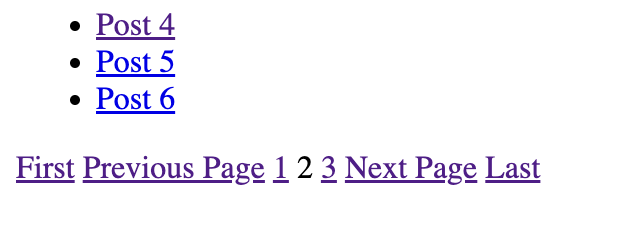
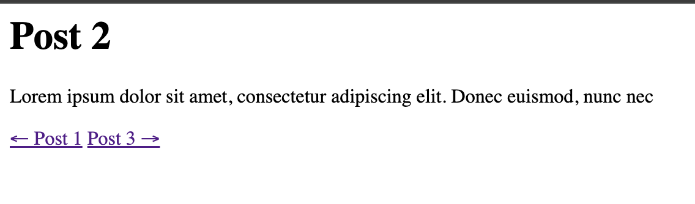

# Pagination
**Table of contents**
- [Pagination](#pagination)
  - [Check it out](#check-it-out)
  - [Home page pagination](#home-page-pagination)
    - [Colections](#colections)
    - [Pagination](#pagination-1)
    - [Permalink](#permalink)
    - [Putting it all together](#putting-it-all-together)
  - [Next and previous links on each post page](#next-and-previous-links-on-each-post-page)

In this experiment we are going to implement two components:
1. A home page with a paginated list of all blog posts:

2. Links to previous and next posts:


## Check it out
1. Run `npm install`
2. Build the project with `npm run build`
3. Serve the project locally with `npm run serve`

## Home page pagination

### Colections
[Collections](https://www.11ty.dev/docs/collections/) is 11ty's feature that allows you to group pages into arrays with tags. By default there's only one collection called `all` that contains all pages. Collections are available in all templates. For example, following code will create list of titles of all posts:
```markdown
<ol>

  <li>{{ post.data.title }}</li>

</ol>
```

### Pagination
[Pagination](https://www.11ty.dev/docs/pagination/) is another feature of 11ty. You can use it to split your list of items into chunks and display them on separate pages.
To create pagination for a [collection](https://www.11ty.dev/docs/collections/) of all posts provide `pagination` field in the frontmatter of your template like this:

*content/paged.njk*
```markdown filename="content/paged.njk"
---
pagination:
  data: collections.all
  size: 3
---
```

- `data` - the [collection](https://www.11ty.dev/docs/pagination/#paging-a-collection) or [array](https://www.11ty.dev/docs/pagination/#paging-an-array) to paginate
- `size` - the number of items per page. 11ty will automatically generate as many pages as needed to display all items in the collection

11ty will provide a `pagination` object to the template with the following properties:
```js
{
  items: [], // Array of current page’s chunk of data
  pageNumber: 0, // current page number, 0 indexed

  // Cool URLs
  hrefs: [], // Array of all page hrefs (in order)
  href: {
    next: "…", // put inside <a href="">Next Page</a>
    previous: "…", // put inside <a href="">Previous Page</a>
    first: "…", // put inside <a href="">First</a>
    last: "…", // put inside <a href="">Last</a>
  },

  pages: [], // Array of all chunks of paginated data (in order)
  page: {
    next: {}, // Next page’s chunk of data
    previous: {}, // Previous page’s chunk of data
    first: {},
    last: {},
  }
}
```

### Permalink
In the example above 11ty will generate pages with following paths:
- /paged
- /paged/1
- /paged/2
- etc.

To customize the path set [permalink](https://www.11ty.dev/docs/permalinks/) field in the frontmatter:

*content/paged.njk*
```markdown filename="content/paged.njk"
---
pagination:
  data: collections.all
  size: 3
permalink: "paged/page-{{ pagination.pageNumber | plus: 1 }}"
---
```

**There's one caveat:**
If your paginated template is called `index` and is located in the root 11ty won't generate any pages by default unless you specify `permalink` in the frontmatter.

### Putting it all together
In my example I wanted home page with pagination to be located at `/` so I created `content/index.njk` in root with following content:

```markdown
---
title: My Posts
pagination:
  data: collections.all
  size: 3
permalink: /{{ "" if pagination.pageNumber === 0 else pagination.pageNumber }}/
---

<ol>

  <li><a href="{{ post.filePathStem }}">{{ post.data.title }}</a></li>

</ol>


  <span>First</span>

  <a href="{{ pagination.href.first }}">First</a>



  <a href="{{ pagination.href.previous }}">Previous Page</a>

  <span>Previous Page</span>



  
    <span>{{ loop.index }}</span>
  
    <a href="{{ href }}">{{ loop.index }}</a>
  



  <a href="{{ pagination.href.next }}">Next Page</a>

  <span>Next Page</span>



  <span>Last</span>

  <a href="{{ pagination.href.last }}">Last</a>

```
The permalink field is set to `/{{ "" if pagination.pageNumber === 0 else pagination.pageNumber }}` which means that the first page will be located at `/` and the rest at `/1`, `/2`, etc.

Read more about Nunjucks's [loops](https://mozilla.github.io/nunjucks/templating.html#for) and [if statements](https://mozilla.github.io/nunjucks/templating.html#if) to understand code better.

## Next and previous links on each post page
Adding links to next and previous posts is a bit more complicated.
TODO: Finish this section
  